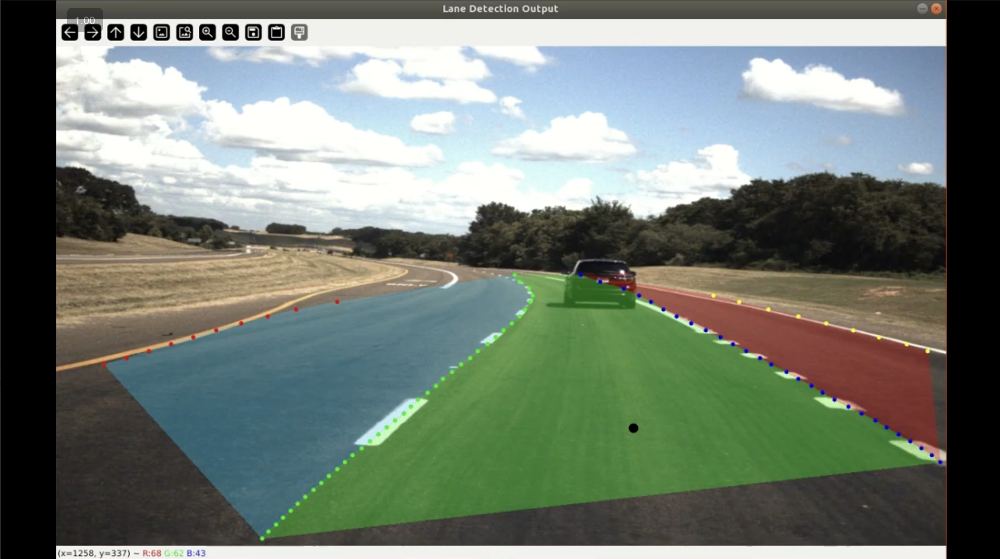

# ULFast-Lane-Detection-ROS
Ultra Fast Lane Detection Integrated with ROS1 and 2d-3d transformation (simple camera-lidar fusion)

 # Rosbag Data video Example 
[](https://drive.google.com/file/d/1AYHfubA9DUPGLKu_sk0-z6z_pLtcFhD7/view?usp=drive_link)

# Installation
cd ~/Ultrafast-Lane-Detection-Inference-Pytorch-
```
pip install -r requirements.txt
pip install yt-dlp
pip install torch 
pip install torchvision
```
If needed: pip install scipy numpy pillow

# Verify Installation for pip3
```
pip3 install -r requirements.txt
pip3 install yt-dlp
```
# PreTrained Models
Download the pretrained model from https://github.com/cfzd/Ultra-Fast-Lane-Detection repository.

Then create a "models" folder in the /lane_detection_catkin_ws/src/lane_detection and /Ultrafast-Lane-Detection-Inference-Pytorch- directories and then save both the .pth files in the models folder.

# Cmake and Source
```
cd ~/lane_detection_catkin_ws
catkin_make
source devel/setup.bash
```
# ROS
1. Verify sourcing:
```
cd ~/lane_detection_catkin_ws
```
3. In the same terminal run:
```
roslaunch lane_detection lane_detection.launch
```
5. Then play your rosbag/ run the nodes. such that it publishes **/resized/camera_fl/image_color** topic
